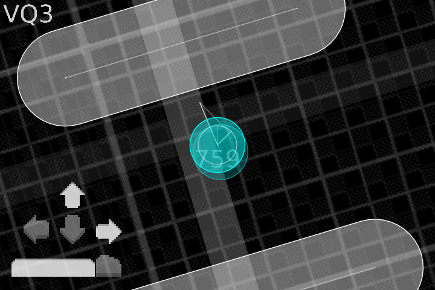
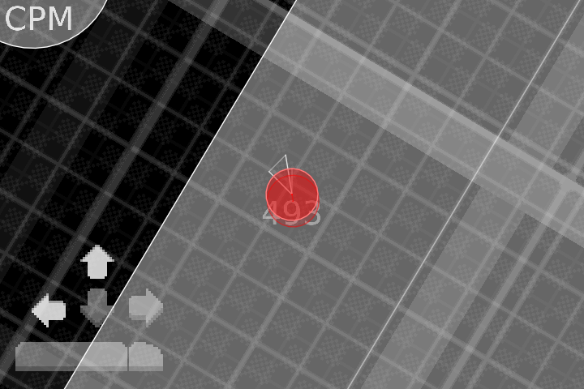
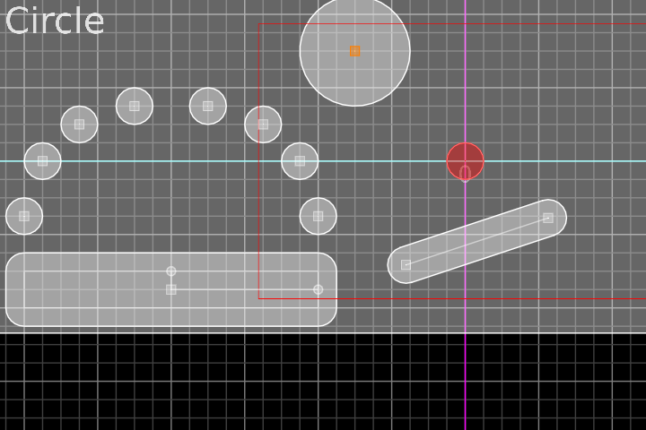

# LÖVEstrafe

A top-down 2D tech demo of Quake-based strafe jumping physics using the LÖVE engine.

Currently supports VQ3 and CPM physics models according to the Quake2/QuakeWorld source codes.

# Controls

| Play ||
| :---: | :---: |
| WASD | Move |
| Mouse | Aim |
| Space | Jump |
| C | Crouch |
| V | Physics |
| M | Fullscreen |
| Backspace | Edit Mode |

| Edit ||
| :---: | :---: |
| Mouse 1 | Move |
| Mouse 2 | Create |
| Mouse 3 | Pan |
| MWheel | Zoom |
| Ctrl + MWheel | Cycle Type |
| Shift | Snap to Grid |
| M | Fullscreen |
| Enter | Play Mode |

# Future Plans

- Support for crouch sliding (Quake 4)
- Stage select with presets for all skill levels
- Tweakable generator for quickly creating a series of jumps (referred to as a "gamma")
- Sfx for footsteps and jumps
- Alternate camera and control styles like world lock or touchscreen mode

# Special Thanks

These amazing modules helped me build it! ...

[30log](https://github.com/Yonaba/30log)  
[anim8](https://github.com/kikito/anim8) (planned)  
[boipushy](https://github.com/adnzzzzZ/boipushy)  
[brinevector](https://github.com/novemberisms/brinevector)  
[Editgrid](https://github.com/bakpakin/Editgrid) (planned)  
[flux](https://github.com/rxi/flux) (planned)  
[hump](https://github.com/vrld/hump)  
[STALKER-X](https://github.com/adnzzzzZ/STALKER-X)  

...and these two helped me deploy it!

[boon](https://github.com/camchenry/boon)  
[LoveWebBuilder](https://github.com/schellingb/LoveWebBuilder) (planned)
